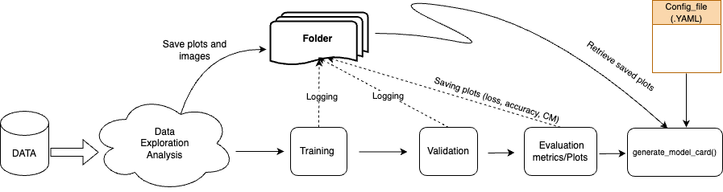

===========
Get Started
===========

Overview
--------

Given a dataset, we perform the exploratory data analysis (EDA). We store the visualization plots into a folder which will be further populated with the plots (loss, accuracy, confusion matrix e.t.c ) after model´s training and validation process is completed. The attributes The pipeline for generating the model card is shown in the fiugure below.

Start with the dataset
-------------------------

For demonstration purpose, we use the training pipeline of deep learning model and the  FACED dataset that is supported by TorchEEG `<https://torcheeg.readthedocs.io/en/latest/>`_. FACED dataset can be downloaded from the link `<https://www.synapse.org/#!Synapse:syn50614194/files/>`_. Online preprocessing
are applied as shown below after converting it into tensors and then fed to neural network as input. 

Setting up the pipeline for generating model card
-----------------------------------------------------

We initialize the TSception model and define its hyperparameters. Next, we configure the training and validation processes using PyTorch . 
After completing these steps, we employ a custom plotting function to generate and save plots for accuracy, loss, and the confusion matrix in the designated folder. 
Finally, we invoke the generate_model_card() function, which requires the path to the YAML config file, the output path for saving the model card, and the model card's
version number. The template of the config file is `here <https://github.com/LucidJun/DREAM/tree/main/template>`_.

.. code:: python

    from torch.utils.data import DataLoader
    import torch
    import torch.nn as nn
    import torch.optim as optim
    import torch.nn.functional as F
    from sklearn.metrics import ConfusionMatrixDisplay
    from tqdm import tqdm
    import matplotlib.pyplot as plt
    from sklearn.metrics import precision_score, recall_score,accuracy_score, f1_score, confusion_matrix
    import seaborn as sns

    from torch.utils.data import DataLoader, random_split
    from torcheeg.datasets import FACEDDataset
    from torcheeg import transforms
    from torcheeg.datasets.constants import FACED_CHANNEL_LOCATION_DICT

    from torcheeg.models.cnn import TSCeption
    import json
    import os
    import time
    from dreams_mc.make_model_card import generate_modelcard

    data_folder= "./processed_data_Face/Processed_data"

    dataset = FACEDDataset(root_path=data_folder,
                       online_transform=transforms.Compose(
                           [transforms.ToTensor(),
                            transforms.To2d()]),
                       label_transform=transforms.Compose([
                           transforms.Select('valence'),
                           transforms.Lambda(lambda x: x + 1)
                       ]))
    
    # dataloaders
    train_size = 0.8 
    batch_size = 32  

    num_train_samples = int(len(dataset) * train_size)
    num_val_samples = len(dataset) - num_train_samples

    # Split the dataset
    train_dataset, val_dataset = random_split(dataset, [num_train_samples, num_val_samples])

    # Create DataLoaders
    train_loader = DataLoader(train_dataset, batch_size=batch_size, shuffle=True)
    val_loader = DataLoader(val_dataset, batch_size=batch_size, shuffle=False)
    
    #Initiate the model
    model = TSCeption(num_classes=9,
                  num_electrodes=30,
                  sampling_rate=250,
                  num_T=15,
                  num_S=15,
                  hid_channels=32,
                  dropout=0.5)

    device= torch.device( "cuda" if torch.cuda.is_available() else "cpu")

    #computing accuracy
    def compute_accuracy(y_pred, y_true):
        # Get the predicted class by selecting the maximum logit (log-probability)
        _, y_pred_tags = torch.max(y_pred, dim=1)
        
        # Compare predictions with true labels
        correct_pred = (y_pred_tags == y_true).float()
        
        # Compute accuracy
        acc = correct_pred.sum() / len(correct_pred)
        return acc

  

    # Training  and validation function
     

    def train(n_epochs, val_acc_max_input, model, optimizer, criterion, scheduler, train_loader, val_loader, checkpoint_path, best_model_path, start_epoch=1):
        val_acc_max = val_acc_max_input
        accuracy_stats = {'train': [], 'val': []}
        loss_stats = {'train': [], 'val': []}
        
        for e in tqdm(range(start_epoch, n_epochs + 1)):
            # TRAINING
            train_epoch_loss = 0
            train_epoch_acc = 0
            model.train()
            for X_train_batch, y_train_batch in train_loader:
                X_train_batch, y_train_batch = X_train_batch.to(device), y_train_batch.to(device)
                optimizer.zero_grad()
                y_train_pred = model(X_train_batch)
                train_loss = criterion(y_train_pred, y_train_batch)
                train_acc = compute_accuracy(y_train_pred, y_train_batch)
                
                train_loss.backward()
                optimizer.step()

                
                train_epoch_loss += train_loss.item()
                train_epoch_acc += train_acc.item()
                
            # VALIDATION
            with torch.no_grad():
                val_epoch_loss = 0
                val_epoch_acc = 0
                model.eval()
                for X_val_batch, y_val_batch in val_loader:
                    X_val_batch, y_val_batch = X_val_batch.to(device), y_val_batch.to(device)
                    y_val_pred = model(X_val_batch)
                    val_loss = criterion(y_val_pred, y_val_batch)
                    val_acc = compute_accuracy(y_val_pred, y_val_batch)
                    
                    val_epoch_loss += val_loss.item()
                    val_epoch_acc += val_acc.item()

            loss_stats['train'].append(train_epoch_loss / len(train_loader))
            loss_stats['val'].append(val_epoch_loss / len(val_loader))
            accuracy_stats['train'].append(train_epoch_acc / len(train_loader))
            accuracy_stats['val'].append(val_epoch_acc / len(val_loader))

            valid_accuracy = val_epoch_acc / len(val_loader)

            print(f'Epoch {e:03}: | Train Loss: {train_epoch_loss / len(train_loader):.5f} | Val Loss: {val_epoch_loss / len(val_loader):.5f} | Train Acc: {train_epoch_acc / len(train_loader):.3f} | Val Acc: {val_epoch_acc / len(val_loader):.3f}')
            
            scheduler.step(val_epoch_loss / len(val_loader))

            # Create checkpoint variable and add important data
            checkpoint = {
                'epoch': e + 1,
                'valid_acc_max': valid_accuracy,
                'state_dict': model.state_dict(),
                'optimizer': optimizer.state_dict(),
            }
            save_ckp(checkpoint, False, checkpoint_path, best_model_path)

            if valid_accuracy > val_acc_max:
                print(f'Validation accuracy increased ({val_acc_max:.6f} --> {valid_accuracy:.6f}).  Saving model ...')
                save_ckp(checkpoint, True, checkpoint_path, best_model_path)
                val_acc_max = valid_accuracy

        return model, accuracy_stats, loss_stats
         
    
   

    class_names = ['Negative', 'Neutral', 'Positive']  
    device = torch.device("cuda" if torch.cuda.is_available() else "cpu")

    optimizer = optim.Adam(model.parameters(), lr=0.001, weight_decay=1e-4)           
    #scheduler = optim.lr_scheduler.CyclicLR(optimizer, base_lr=1e-6, max_lr=0.01)
    scheduler = optim.lr_scheduler.ReduceLROnPlateau(optimizer, mode='min', factor=0.1, patience=10, verbose=True)

    criterion = nn.CrossEntropyLoss()

    # Model Training 
    valid_acc_max = 0.0
    trained_model, accuracy_stats, loss_stats = train(220, valid_acc_max, model, optimizer, criterion, scheduler, train_loader, val_loader, "./logs/current_checkpoint.pt", "./logs/best_model.pt", start_epoch=1)
    # plotting and saving training and validation plots 
    plot_training_validation_stats(accuracy_stats, loss_stats, save_dir='./logs')

    # Load the best model for evaluation
    checkpoint_path = './logs/best_model.pt'
    checkpoint = torch.load(checkpoint_path, map_location=torch.device('cpu'))
    model.load_state_dict(checkpoint['state_dict'])

    # Evaluate the model and saving the required  plots
    results = evaluate_model(model=model, data_loader=val_loader, device=device)
    plot_metrics_table(results, model_name='TSception',save_path="./logs/table.png")
    plot_confusion_matrix(results['confusion_matrix'], class_names,save_path="./logs/cm.png")
    plot_confidence_intervals(precision=results['precision'], recall=results['recall'], 
                              accuracy=results['accuracy'], f1=results['f1_score'], 
                              n=len(val_loader.dataset), save_path="./logs/CI_plot.png", 
                              confidence=0.95)

    # Generating model card
    print("Generating Model Card....")
    config_file_path = './config.yaml'
    output_path = './logs/model_card.html'
    version_num = '1.0'
    generate_modelcard(config_file_path, output_path, version_num)
        

        

